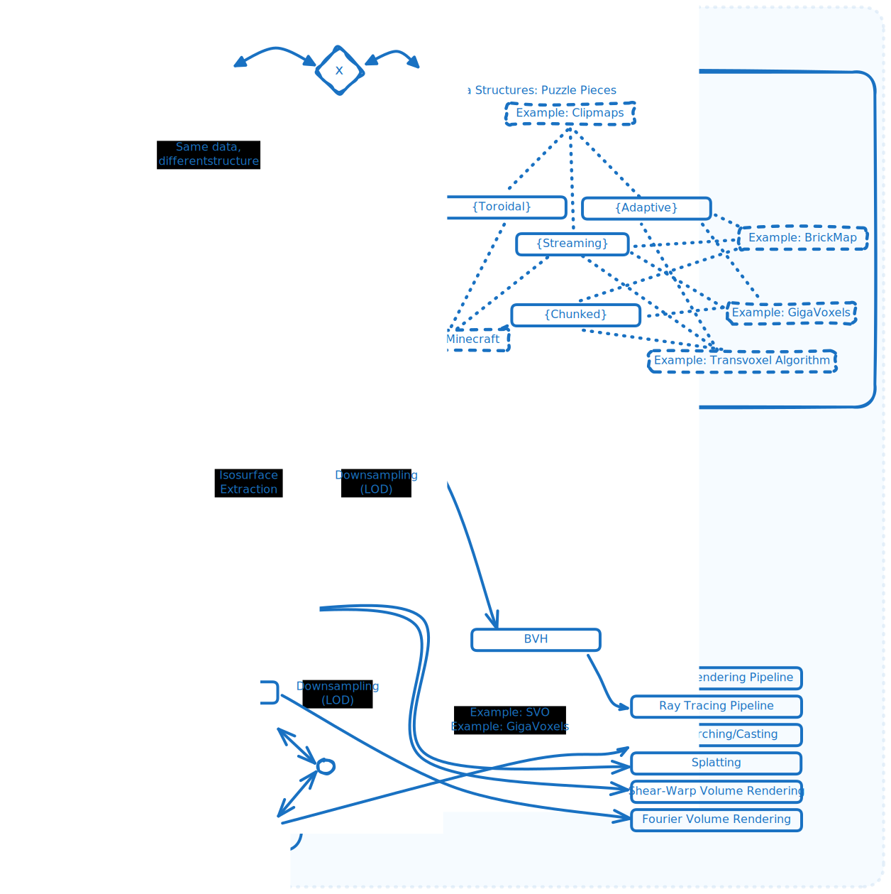

<!--

WARNING: This file is auto-generated by snipinator. Do not edit directly.
SOURCE: `README.md.jinja2`.

-->
<!--

-->

# Excalidraw Brute Export CLI

- What: Uses playwright to run a headless firefox browser to export Excalidraw
  diagrams to svg/png files. Using a browser bypasses certain bugs that happen
  with other projects that attempt to export by emulating the DOM (without a
  browser).
- Why:
  - To allow automated export of Excalidraw diagrams to svg/png files via the
    command line.
  - Currently, Excalidraw can only be exported by a human clicking on the
    "Export image" button.
  - Addresses/mitigates
    [excalidraw/excalidraw#1261](https://github.com/excalidraw/excalidraw/issues/1261)
    `excalidraw CLI #1261` which is an open feature request on the Excalidraw
    project.
  - Addresses/mitigates
    [JRJurman/excalidraw-to-svg#6](https://github.com/JRJurman/excalidraw-to-svg/issues/6)
    `Error rendering edge-labels. #6`.
  - Addresses/mitigates
    [Timmmm/excalidraw_export#6](https://github.com/Timmmm/excalidraw_export/issues/6)
    `Error rendering edge-labels. #6`.
- Related Projects
  - [JRJurman/excalidraw-to-svg](https://github.com/JRJurman/excalidraw-to-svg)
    uses jsdom to simulate the DOM, then runs Excalidraw+react in nodejs, loads
    the diagram files and exports them.
  - [Timmmm/excalidraw_export](https://github.com/Timmmm/excalidraw_export)
    similar to `JRJurman/excalidraw-to-svg` but simplifies the code and also
    embeds SVG fonts.

## Usage

```bash
# Install globally from npm registry.
npm install -g excalidraw-brute-export-cli

# Or install globally, direct from GitHub:
npm install -g https://github.com/realazthat/excalidraw-brute-export-cli.git#v0.2.0

# Might prompt for root.
npx playwright install-deps
npx playwright install firefox
```

Example:

<!----><!---->

And the resulting image (svg):



CLI usage help:

<!----><!---->

Tested on:

- WSL2 Ubuntu 20.04, Node `v20.12.1
`.

## Contributions

### Development environment: Linux-like

- For running `pre.sh` (Linux-like environment).
  - Requires nodejs (for act).
  - Requires Go (to run act).
  - docker (for act).

### Commit Process

1. (Optionally) Fork the `develop` branch.
2. Stage your files: `git add path/to/file.py`.
3. `bash scripts/pre.sh`, this will format, lint, and test the code.
4. `git status` check if anything changed (generated `README.md` for
   example), if so, `git add` the changes, and go back to the previous step.
5. `git commit -m "..."`.
6. Make a PR to `develop` (or push to develop if you have the rights).

## Release Process

These instructions are for maintainers of the project.

1. In the `develop` branch, run `bash scripts/pre.sh` to ensure
   everything is in order.
2. In the `develop` branch, bump the version in `package.json`,
   following semantic versioning principles. Run `bash scripts/pre.sh` to ensure
   everything is in order.
3. In the `develop` branch, commit these changes with a message like
   `"Prepare release X.Y.Z"`. (See the contributions section
   [above](#commit-process)).
4. Merge the `develop` branch into the `master` branch:
   `git checkout master && git merge develop --no-ff`.
5. `master` branch: Tag the release: Create a git tag for the release with
   `git tag -a vX.Y.Z -m "Version X.Y.Z"`.
6. Publish to PyPI: Publish the release to PyPI with
   `bash scripts/deploy-to-npm.sh`.
7. Push to GitHub: Push the commit and tags to GitHub with
   `git push && git push --tags`.
8. The `--no-ff` option adds a commit to the master branch for the merge, so
   refork the develop branch from the master branch:
   `git checkout develop && git merge master`.
9. Push the develop branch to GitHub: `git push origin develop`.
